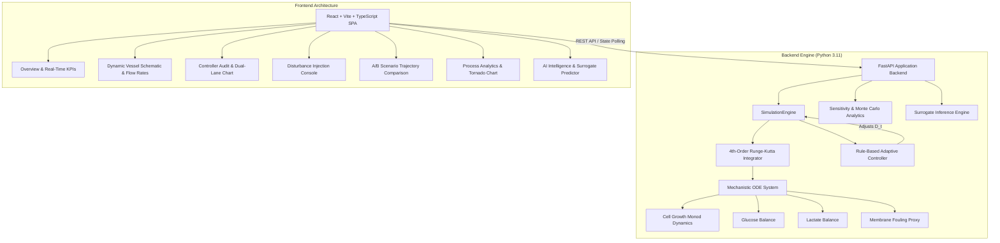

# Bioreactor Twin — Mammalian Cell Perfusion Digital Twin Platform

[](https://github.com/your-username/bioreactor-digital-twin/actions)
[](https://www.python.org/downloads/)
[](https://fastapi.tiangolo.com)
[](https://react.dev)
[](https://www.typescriptlang.org/)
[](https://opensource.org/licenses/MIT)

A high-fidelity, real-time **Digital Twin of a Mammalian Cell Perfusion Bioreactor** ($CHO-K1$) designed for bioprocess monitoring, predictive analytics, fault injection, and closed-loop adaptive feedback control.

The platform couples continuous **4th-Order Runge-Kutta (RK4) mechanistic ODE numerical integration** with an automated closed-loop feedback controller, stochastic process analytics (Monte Carlo & local sensitivity analysis), and machine learning surrogate models.

---

## Key Highlights

- **Mechanistic Bioprocess Engine**:
  - Viable and non-viable cell growth dynamics with Monod kinetics and viability decline.
  - Substrate consumption (Glucose) with maintenance and yield parameters ($Y_{X/S}, m_s$).
  - Toxic metabolite accumulation (Lactate) with cell-specific production rates ($q_{lac}$) and growth inhibition ($K_{I,lac}$).
  - Dynamic perfusion media exchange with sterile fresh feed replenishment and continuous harvest clearance.
  - Empirical membrane fouling risk proxy ($0–100\%$) tracking cumulative biomass load, perfusion rate and shear stress.
  - Strict physical non-negativity and mass balance constraints solved via RK4 ($\Delta t = 0.5\text{ h}$).

- **Closed-Loop Adaptive Feedback Controller**:
  - Real-time perfusion rate manipulation ($D(t)$) responding to critical metabolic boundaries:
    - **Glucose starvation threshold**: Triggers feed step increments ($\Delta D \le 0.5\text{ VVD}$) when $S(t) \le 2.0\text{ g/L}$.
    - **Lactate toxicity threshold**: Accelerates perfusion washout when $P(t) \ge 3.0\text{ g/L}$.
    - **Filter fouling safety clamp**: Throttles perfusion or flags alert when fouling risk exceeds critical thresholds.
  - Enforces minimum deadband hysteresis ($2.0\text{ h}$) and step rate limits to avoid actuator hunting.
  - Live, verifiable controller audit trail logging exact timestamps, trigger parameters, and state deviations.

- **Scenario Comparison & Sandbox**:
  - Run parallel comparative simulations: **Uncontrolled baseline** vs. **Active closed-loop feedback control**.
  - Quantifies delta in final viable cell density (VCC), residual nutrient levels, and filter lifespan.

- **Fault Injection & Process Resilience**:
  - Inject acute disturbances during the run:
    - **Nutrient Depletion**: Feed glucose concentration drop ($S_{feed} \to 2.5\text{ g/L}$).
    - **Cell Lysis Event**: Acute viability crash and cell death surge.
    - **Filter Membrane Fouling Surge**: Accelerated clogging and hydraulic resistance.
  - Observe real-time closed-loop recovery trajectories vs. uncontrolled failure.

- **Process Analytics & Surrogate Intelligence**:
  - Local One-At-A-Time (OAT) parameter sensitivity tornado analysis ($\pm 20\%$ perturbations across $\mu_{max}, K_s, Y_{x/s}, m_s, q_{lac}, K_{I,lac}$).
  - Monte Carlo stochastic uncertainty distribution modeling.
  - Machine learning surrogate pipelines trained on benchmark bioprocess datasets.

---

## System Architecture



---

## Directory Structure

```text
├── backend/
│   ├── app/
│   │   ├── api/             # FastAPI REST endpoints (simulation, ai, analytics)
│   │   ├── control/         # Adaptive rule-based controller logic
│   │   ├── ml/              # Surrogate ML models, preprocessors, inference engines
│   │   ├── models/          # Pydantic state and configuration schemas
│   │   ├── simulation/      # RK4 numerical integrator, ODE derivatives, fouling model
│   │   ├── tests/           # Comprehensive pytest suite (67 unit & integration tests)
│   │   └── main.py          # FastAPI application entrypoint
│   ├── requirements.txt     # Python pinned dependencies
│   └── Dockerfile           # Backend container definition
├── frontend/
│   ├── public/              # Static assets, favicon, robots.txt
│   ├── src/
│   │   ├── components/      # Modular UI components (Dashboard, Controller, Charts)
│   │   ├── context/         # Application state contexts (Toast, AI)
│   │   ├── services/        # Axios API client services
│   │   ├── types/           # TypeScript data interfaces
│   │   ├── App.tsx          # Root layout and state orchestrator
│   │   └── main.tsx         # Frontend React entrypoint
│   ├── nginx.conf           # Production Nginx reverse proxy configuration
│   ├── package.json         # NPM package dependencies
│   └── Dockerfile           # Multi-stage production container build
├── .github/
│   └── workflows/
│       └── ci.yml           # GitHub Actions automated test & build pipeline
├── docker-compose.yml       # 1-command Docker orchestration
├── .gitignore               # Clean repository ignore rules
└── README.md                # Documentation
```

---

## Quickstart Guide

### Option 1: Docker Compose (Recommended)

Run the entire platform (backend, frontend, and reverse proxy) with a single command:

```bash
docker compose up --build
```

- **Frontend Application**: [http://localhost:3000](http://localhost:3000)
- **Backend API Docs (Swagger)**: [http://localhost:8000/docs](http://localhost:8000/docs)
- **API Health Check**: [http://localhost:8000/health](http://localhost:8000/health)

---

### Option 2: Local Development Setup

#### 1. Backend Setup

```bash
# Navigate to backend directory
cd backend

# Create and activate virtual environment
python -m venv venv
# On Windows:
.\venv\Scripts\activate
# On Linux/macOS:
source venv/bin/activate

# Install dependencies
pip install -r requirements.txt

# Run test suite
pytest -v

# Start development server
uvicorn app.main:app --reload --host 127.0.0.1 --port 8000
```

#### 2. Frontend Setup

```bash
# Navigate to frontend directory
cd frontend

# Install npm packages
npm install

# Run TypeScript type check
npx tsc --noEmit

# Start Vite development server
npm run dev
```

Open [http://localhost:5173](http://localhost:5173) in your browser.

---

## REST API Specification

| Method | Endpoint | Description |
| :--- | :--- | :--- |
| `GET` | `/health` | Server & simulation engine status check |
| `GET` | `/api/v1/simulation/config/default` | Returns default bioreactor physical parameters |
| `POST` | `/api/v1/simulation/config/validate` | Validates custom parameter configurations |
| `POST` | `/api/v1/simulation/initialize` | Resets and initializes bioreactor state at $t = 0\text{ h}$ |
| `POST` | `/api/v1/simulation/step` | Integrates one RK4 time step ($\Delta t = 0.5\text{ h}$) |
| `POST` | `/api/v1/simulation/run` | Runs full simulation trajectory to completion |
| `POST` | `/api/v1/simulation/fault/inject` | Injects an active process disturbance |
| `POST` | `/api/v1/simulation/fault/clear` | Clears active disturbances |
| `POST` | `/api/v1/simulation/scenario/compare` | Runs parallel controlled vs uncontrolled runs |
| `GET` | `/api/v1/simulation/control` | Fetches active controller settings and policies |
| `POST` | `/api/v1/simulation/control` | Updates controller operating limits and thresholds |
| `POST` | `/api/v1/analytics/sensitivity` | Calculates local sensitivity index tornado data |
| `POST` | `/api/v1/analytics/monte-carlo` | Performs stochastic parameter uncertainty sweeps |

Interactive OpenAPI documentation is automatically available at `/docs` or `/redoc`.

---

## Testing & Quality Assurance

The codebase adheres to rigorous testing and automated verification:

- **Backend Pytest Suite**: 67 automated tests covering ODE boundary limits, numerical conservation of mass, closed-loop feedback logic, and API schemas.
- **Frontend Type Safety**: Strict TypeScript compilation (`npx tsc --noEmit`) with 0 type errors.
- **Continuous Integration**: Automated GitHub Actions workflow checks every commit and pull request.

---

## License

This project is licensed under the MIT License — see the [LICENSE](LICENSE) file for details.
